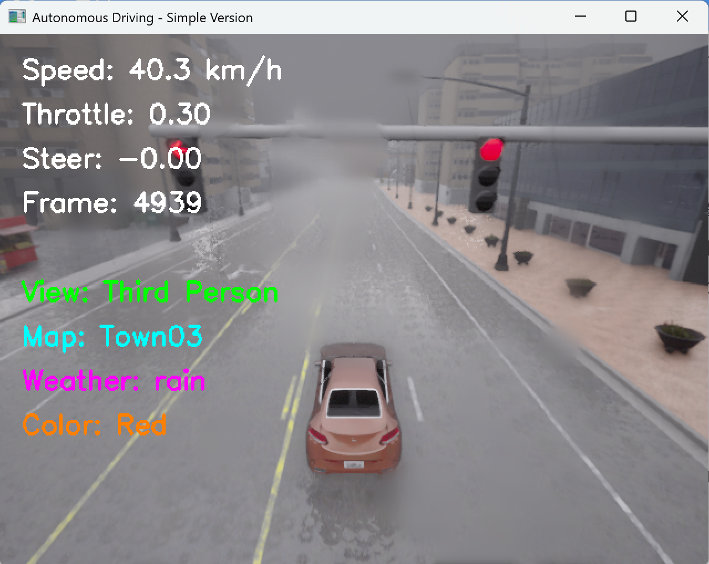
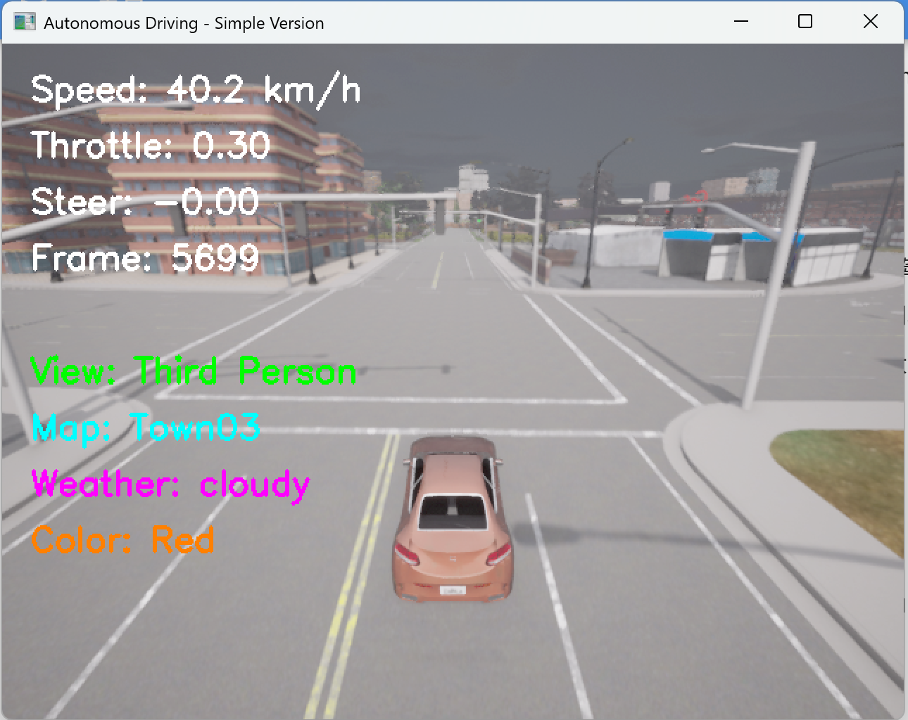
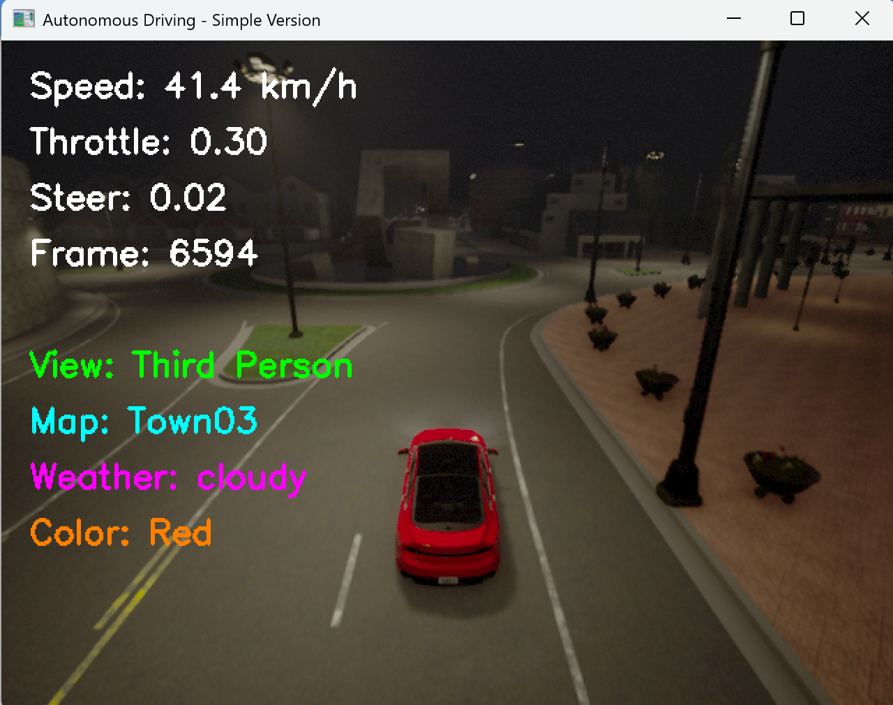
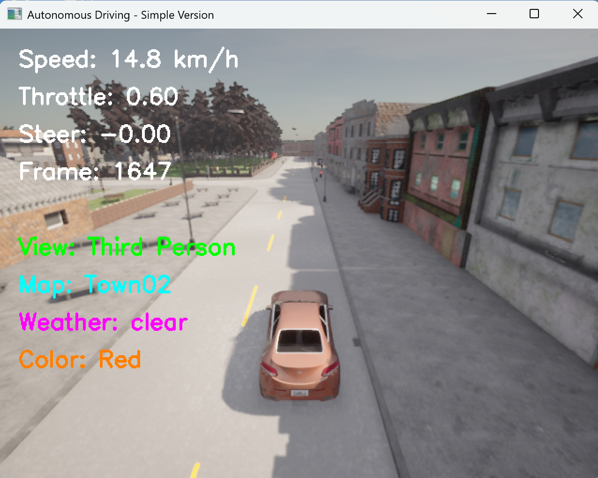
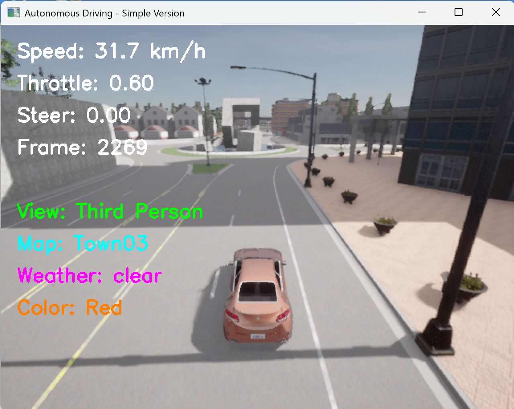
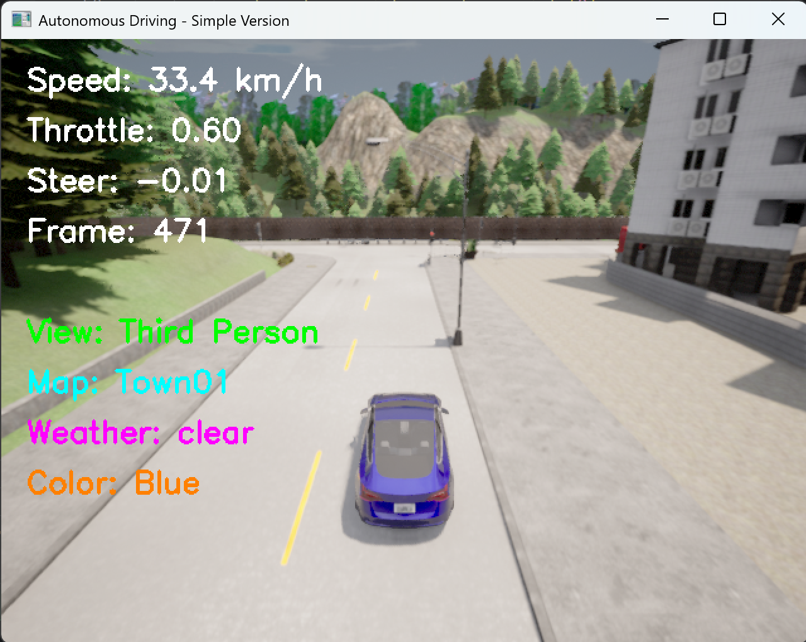
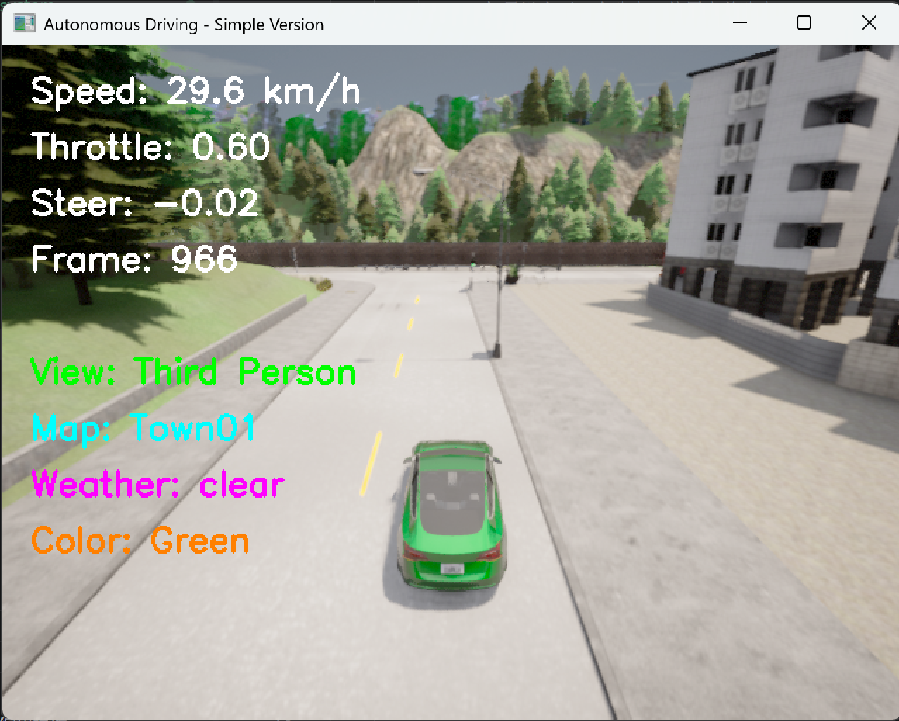

# 基于 CARLA 的多视角自动驾驶仿真系统文档

## 1. 项目概述

### 1.1 项目简介

本项目基于 CARLA 自动驾驶仿真平台开发一套全功能交互式自动驾驶仿真系统，依托路点循迹算法实现车辆自主行驶，集成多视角相机、多车辆/颜色切换、天气/地图切换、AR 导航、HUD 仪表盘、轨迹可视化、夜晚灯光、截图录制、NPC 车流等实用功能。系统采用模块化设计，代码稳定易运行，纯脚本实现无需深度学习模型，可作为 CARLA 自动驾驶入门、二次开发、功能拓展的标准工程基线。

系统实现按键交互 → 车辆控制 → 路点循迹自动驾驶 → 多传感器可视化 → 仿真状态反馈的完整闭环，兼容 Windows/Linux 平台，支持实时人机交互与状态切换。

### 1.2 项目整体流程

整体运行闭环：
键盘指令输入 → 系统状态切换 → 车辆控制器(路点循迹) → 车辆执行动作 → 相机采集图像 → 可视化叠加(HUD/AR/轨迹) → 画面输出 + 状态日志

### 1.3 项目组成

| 模块 | 类/核心函数 | 功能说明 |
|------|-----------|---------|
| 车辆控制模块 | SimpleController | 路点提取、转向计算、速度闭环、前进/倒车模式切换 |
| 系统主框架 | SimpleDrivingSystem | 服务连接、车辆/相机/NPC生成、全局状态管理、按键响应 |
| 相机模块 | setup_camera / camera_callback | 多视角相机挂载、图像数据回调、画面刷新 |
| 可视化模块 | draw_hud / draw_ar_navigation | 仪表盘绘制、AR导航箭头叠加、文字状态显示 |
| 地图与轨迹 | generate_topology_map / world_to_map | 道路拓扑图生成、车辆轨迹绘制、世界坐标转像素坐标 |
| 场景控制 | set_weather / toggle_night_mode | 天气切换、昼夜模式 + 车辆灯光联动 |
| 资源管理 | spawn_vehicle / cleanup | 车辆/NPC生成、资源销毁、程序退出清理 |
| 交互逻辑 | 主循环按键监听 | 视角/地图/颜色/车型/截图/紧急停止等按键响应 |

### 1.4 核心技术特点

| 功能特点 | 详细说明 |
|---------|---------|
| 自主循迹驾驶 | 基于 CARLA 原生路点(Waypoint)实现前瞻路径跟踪，速度+转向双闭环控制 |
| 多视角切换 | 第一人称、第三人称、鸟瞰图三种相机视角，一键无缝切换 |
| 丰富场景配置 | 7款标准城镇地图、4种预设天气、昼夜模式自动切换车灯 |
| 车辆自定义 | 10款主流车型、10种车身颜色自由切换 |
| 辅助驾驶可视化 | 实景 AR 导航箭头、车载 HUD 仪表盘、全局行驶轨迹地图 |
| 基础行车功能 | 前进/手动倒车模式、紧急制动、车辆位置重置 |
| 数据记录 | 一键截图，自动命名(时间+地图+天气+颜色)并本地保存 |
| 车流仿真 | 自动生成 NPC 自动驾驶车辆，模拟真实道路交通环境 |
| 高鲁棒性 | 重复生成保护、资源自动清理、异常捕获、报错友好提示 |

### 1.5 运行环境与使用方式

**环境依赖安装**
```bash
pip install carla numpy opencv-python
```

**前置要求**：本地已启动 CARLA 仿真服务器（默认端口 2000）

**运行入口**
将代码保存为 carla_autodrive.py，执行：
```bash
python carla_autodrive.py
```

### 1.6 项目核心目标

- 基础自动驾驶落地：依托路点循迹实现车辆稳定自主行驶，可前进、可倒车。
- 全场景交互能力：支持视角、地图、天气、车型、颜色等实时切换，模拟真实驾驶体验。
- 可视化辅助驾驶：集成 HUD、AR 导航、轨迹图，直观展示车辆状态与行驶路径。
- 工程稳定性：完善异常捕获、资源销毁、重复生成容错，长时间运行不崩溃。
- 可拓展性：模块化代码结构，便于后续添加雷达、感知算法、决策规划等高级功能。

## 2. 项目背景与问题定义

### 2.1 项目背景

CARLA 是业界主流开源自动驾驶仿真平台，内置完整城镇地图、交通参与者、传感器接口，广泛用于自动驾驶算法开发、测试与教学。

传统 CARLA 入门脚本大多仅实现单车简单行驶，缺少集成化功能与交互逻辑，无法满足演示、调试、拓展需求。本项目基于原生 CARLA API 搭建一套功能完整、交互友好、工程化的自动驾驶仿真框架，补齐基础功能短板。

### 2.2 现存痛点

- 原生示例代码功能单一，无多视角、可视化、场景切换功能；
- 车辆生成易冲突、重复生成导致仿真卡死，缺少容错逻辑；
- 前进/倒车、速度转向控制逻辑粗糙，行驶轨迹抖动明显；
- 相机、车辆、NPC 资源销毁不彻底，多次运行内存占用持续升高；
- 缺少驾驶辅助可视化（仪表盘、导航、轨迹），状态展示不直观；
- 昼夜、天气、车型等场景配置需要修改代码，无法实时交互切换。

本项目针对以上问题进行整体优化，打造开箱即用的 CARLA 自动驾驶仿真基线系统。

### 2.3 项目建设目标

- 实现稳定路点循迹自动驾驶，行驶平顺、转向合理；
- 完成多维度实时交互：视角、地图、天气、车型、颜色一键切换；
- 搭建多层可视化系统：文字状态、HUD 仪表盘、AR 导航、全局轨迹图；
- 完善资源管理与异常处理，保证程序健壮性；
- 模块化分层设计，支持后续拓展激光雷达、图像感知、决策规划等算法。

## 3. 核心技术栈与理论基础

### 3.1 核心技术栈

| 技术分类 | 具体选型 | 作用说明 |
|---------|---------|---------|
| 仿真平台 | CARLA 0.9.x | 三维城镇仿真环境、路点系统、车辆/传感器 API |
| 开发语言 | Python 3.7+ | 主程序开发、逻辑控制、交互处理 |
| 数值计算 | NumPy | 坐标转换、图像矩阵运算、角度计算 |
| 视觉处理 | OpenCV-Python | 图像渲染、绘图、窗口显示、截图保存 |
| 基础库 | math / collections.deque / random | 角度/距离计算、轨迹点缓存、随机生成 |

### 3.2 仿真层：CARLA 核心能力

CARLA 基于 Unreal Engine 开发，本项目主要使用其核心模块：

- 世界与地图：加载 Town01~Town07 标准城镇地图，获取全局路点、车辆出生点；
- 车辆蓝图系统：调用官方车辆蓝图，自定义车身颜色、车型；
- RGB 相机传感器：挂载第一/第三/鸟瞰视角相机，异步采集图像数据；
- 路点(Waypoint)系统：道路采样点，作为自动驾驶循迹参考路径；
- Actor 管理：统一管理车辆、传感器、NPC，支持生成、销毁、状态控制；
- 天气与光照：动态修改云层、雨量、太阳高度角，实现昼夜、雨雪天气模拟。

**核心相关代码**
- 服务连接与地图加载：SimpleDrivingSystem.connect()
- 车辆/NPC 生成：spawn_vehicle() / spawn_npc_vehicles()
- 相机创建与回调：setup_camera() / camera_callback()

### 3.3 控制层：路点循迹控制器 SimpleController

控制器是自动驾驶核心，采用前瞻路点跟踪 + 速度闭环方案，分为转向控制和速度控制两大逻辑，同时支持前进/倒车模式切换。

#### 3.3.1 整体控制逻辑

控制器每一帧执行流程：
1. 获取车辆当前位置、姿态、行驶速度；
2. 判断倒车模式，直接输出倒车控制指令；
3. 根据车辆位置获取当前道路路点，向前采样前瞻路点；
4. 计算车辆与目标路点的相对偏角，换算为方向盘转向量；
5. 根据实时车速与目标车速对比，分配油门/刹车；
6. 输出(油门, 刹车, 转向, 倒车标志)四元控制量。

#### 3.3.2 转向控制原理

以车辆自身坐标系为基准，将世界坐标下的目标路点转换为车辆局部坐标，计算航向偏差角：

1. 提取车辆偏航角 yaw，构建坐标旋转矩阵；
2. 计算目标路点与车辆的全局偏移量 dx, dy；
3. 坐标转换得到车辆局部前后/左右偏移；
4. 通过反正切计算偏差角，限幅后作为转向输出（范围 -0.5 ~ 0.5）。

**核心代码片段**：
```python
vehicle_yaw = math.radians(transform.rotation.yaw)
dx = target_loc.x - location.x
dy = target_loc.y - location.y
local_x = dx * math.cos(vehicle_yaw) + dy * math.sin(vehicle_yaw)
local_y = -dx * math.sin(vehicle_yaw) + dy * math.cos(vehicle_yaw)
angle = math.atan2(local_y, local_x)
steer = max(-0.5, min(0.5, angle / 1.0))
```

#### 3.3.3 速度闭环控制

设定目标车速 50 km/h，分三段式调速：
- 车速 < 目标速 80%：全油门加速；
- 车速 > 目标速 120%：施加刹车减速；
- 区间内：小油门保持匀速行驶。

同时支持手动切换倒车模式，仅在车辆静止时允许切换，防止行驶中切换导致失控。

#### 3.3.4 车辆控制指令映射

CARLA 车辆控制结构体 carla.VehicleControl 接收标准化参数：
throttle(0~1)、brake(0~1)、steer(-1~1)、reverse(布尔)、hand_brake。

控制器输出直接映射至该结构体，驱动车辆运动。

### 3.4 可视化层：OpenCV 图像渲染

基于 OpenCV 实现多层画面叠加，所有绘制逻辑在相机图像基础上二次渲染：

- 基础文字状态：车速、油门、转向、帧数、视角、地图、天气、车身颜色；
- HUD 仪表盘：右上角半透明仪表盘，包含圆形速度表、油门/刹车进度条、转向指示、帧率；
- AR 实景导航：画面底部叠加方向箭头，显示直行/左转/右转、距离、偏转角度；
- 全局轨迹地图：右下角嵌入道路拓扑图，实时绘制车辆行驶轨迹。

### 3.5 场景控制模块

#### 3.5.1 天气与昼夜模式

- 内置 4 种基础天气：晴天、大雨、多云、湿滑路面；
- 昼夜模式通过修改太阳高度角实现，夜间自动开启车辆近光灯，白天关闭灯光。







#### 3.5.2 地图切换

支持 Town01~Town07 七款官方城镇地图，切换逻辑：
停止相机 → 销毁车辆 → 加载新地图 → 重新生成车辆/相机/NPC → 恢复原有配置。





#### 3.5.3 车辆自定义

- 车型切换：内置 10 款经过验证的可用车辆蓝图（特斯拉、福特、奥迪、宝马等）；
- 颜色切换：红、蓝、绿、黄、紫等 10 种纯色车身，切换时保留当前车型。





### 3.6 工程化核心机制

#### 3.6.1 资源容错机制

车辆重复生成失败时，自动销毁场景内所有车辆，清空冲突 Actor 后重试，避免生成卡死。

```python
# 车辆生成失败容错逻辑
if not self.vehicle:
    print("无法生成车辆，尝试清理现有车辆...")
    for actor in self.world.get_actors().filter('vehicle.*'):
        actor.destroy()
    time.sleep(0.5)
    self.vehicle = self.world.try_spawn_actor(vehicle_bp, spawn_point)
```

#### 3.6.2 轨迹缓存

使用 deque 定长缓存轨迹点（最大 500 个），避免内存持续增长，实时绘制行驶路径。

#### 3.6.3 坐标转换

将 CARLA 世界三维坐标，映射为拓扑地图二维像素坐标，实现全局轨迹可视化。

#### 3.6.4 资源统一清理

程序退出时，依次销毁相机传感器、主车辆、NPC 车辆，彻底释放仿真资源。

## 4. 系统整体架构

本系统采用分层模块化架构，从上至下分为 5 层，形成完整闭环：

1. **交互层**：键盘按键监听，接收用户操作指令；
2. **场景管理层**：地图、天气、车型、视角、灯光等全局状态调度；
3. **决策控制层**：SimpleController 路点循迹、速度/转向计算、倒车逻辑；
4. **执行层**：CARLA 车辆执行控制指令，完成行驶动作；
5. **感知可视化层**：相机采集图像 → OpenCV 叠加 HUD/AR/轨迹 → 窗口输出画面。

各模块低耦合、高内聚，单个功能模块修改不会影响整体运行。

## 5. 系统功能优化点

### 5.1 优化一：多相机解耦设计

**问题**：单相机无法满足不同视角观察需求，切换视角需要重启传感器。

**优化**：同时挂载 3 路独立相机（第一/第三/鸟瞰），通过标识区分相机数据，仅渲染当前视角图像。

**效果**：视角切换毫秒级响应，无卡顿、无传感器重启延迟。

### 5.2 优化二：车辆生成容错与冲突处理

**问题**：CARLA 同一位置重复生成车辆会直接失败，导致程序终止。

**优化**：生成失败时自动清空场景内所有车辆，延迟后重试；多出生点轮询尝试。

**效果**：车辆、车型、颜色切换稳定性大幅提升，极少出现生成失败。

### 5.3 优化三：倒车模式安全限制

**问题**：行驶中切换倒车易造成车辆失控、急刹甩尾。

**优化**：增加速度判断，仅当车速 < 1 km/h 时，才允许切换前进/倒车模式。

**效果**：规避危险操作，提升仿真安全性。

### 5.4 优化四：分层可视化渲染

**问题**：单一画面仅能看行驶画面，无法直观获取车辆状态、路径信息。

**优化**：分层叠加 基础文字 + HUD 仪表盘 + AR 导航 + 全局轨迹图，多维度信息展示。

**效果**：驾驶状态、行驶路径、前方路况一目了然，便于算法调试与演示。

### 5.5 优化五：昼夜与灯光联动

**问题**：夜间场景漆黑，无车灯模拟，仿真真实性差。

**优化**：切换夜间模式时自动开启车辆近光灯，切回白天自动关闭灯光。

**效果**：还原真实夜间行车场景。

### 5.6 优化六：一键截图自动命名

**问题**：手动截图命名繁琐，无法区分不同场景下的画面。

**优化**：自动创建截图文件夹，文件名拼接时间戳 + 地图 + 天气 + 车身颜色。

**效果**：截图分类清晰，便于后续素材整理与对比。

### 5.7 优化七：NPC 车流仿真

**问题**：单辆车行驶场景空旷，缺少真实交通氛围。

**优化**：自动生成多辆 NPC 车辆并开启自动驾驶，模拟城市车流。

**效果**：仿真场景更贴近真实道路环境。

### 5.8 优化八：状态实时文字提示

**问题**：用户无法感知当前系统状态（视角、模式、故障）。

**优化**：画面实时打印车速、模式、地图、天气、颜色，控制台输出关键操作日志。

**效果**：人机交互体验提升，故障排查更便捷。

### 5.9 优化九：紧急制动与车辆重置

**问题**：车辆偏离道路后无法快速复位，紧急情况无制动手段。

**优化**：增加紧急刹车按键、车辆位置随机重置按键。

**效果**：快速修正车辆位置，适应反复调试场景。

## 6. 核心技术难点与解决方案

### 6.1 难点一：车辆局部坐标转换，转向偏差大

**问题**：直接使用世界坐标计算转向，未考虑车辆自身朝向，导致转向反向、轨迹跑偏。

**解决方案**：基于车辆偏航角做二维坐标旋转变换，统一至车辆局部坐标系计算偏差角，转向精准可控。

### 6.2 难点二：多传感器资源泄露

**问题**：频繁切换视角/车辆/地图时，相机、车辆 Actor 未彻底销毁，多次运行后 CARLA 内存溢出。

**解决方案**：封装统一 cleanup 方法，每次切换/退出前，遍历销毁所有传感器与车辆，清空 Actor 占用。

### 6.3 难点三：路点采样异常导致车辆停驶

**问题**：道路尽头、路口位置无后续路点，控制器无目标点导致车辆停滞。

**解决方案**：判断前瞻路点是否为空，为空则沿用当前路点继续行驶，保证行驶连续性。

### 6.4 难点四：图像回调线程冲突

**问题**：CARLA 相机为异步回调，多相机同时回调易造成图像覆盖、画面闪烁。

**解决方案**：相机回调增加视角标识，仅更新当前激活视角的图像数据，其余相机数据丢弃。

### 6.5 难点五：拓扑地图坐标映射错位

**问题**：CARLA 世界坐标范围大，直接绘制会超出图像边界。

**解决方案**：遍历全路点计算坐标极值，做等比例缩放+偏移，将世界坐标映射至像素画布。

## 7. 系统运行说明

### 7.1 运行环境

| 项目 | 配置 |
|------|------|
| 操作系统 | Windows 10/11、Ubuntu 18.04/20.04 |
| 仿真软件 | CARLA 0.9.12 / 0.9.14（主流稳定版本） |
| Python 版本 | 3.7 ~ 3.10 |
| 依赖库 | carla、numpy、opencv-python |

### 7.2 全局按键对照表

| 按键 | 功能 |
|------|------|
| q | 退出程序，清理所有资源 |
| r | 随机重置车辆位置 |
| s | 紧急制动（拉手刹） |
| x | 切换前进/倒车模式（仅静止时生效） |
| v | 循环切换 第一人称/第三人称/鸟瞰图 |
| m | 循环切换 Town01~Town07 地图 |
| w | 循环切换 晴天/雨天/多云/湿滑 天气 |
| c | 切换车身颜色 |
| u | 切换车辆品牌/车型 |
| l | 切换昼夜模式（自动开关车灯） |
| d | 开启/关闭全局行驶轨迹图 |
| y | 开启/关闭 HUD 仪表盘 |
| i | 开启/关闭 AR 实景导航箭头 |
| p | 截取当前画面并保存至本地 screenshots 文件夹 |

### 7.3 运行效果说明

- **初始状态**：默认 Town01 地图、第三人称视角、晴天、红色特斯拉 Model3，车辆自动向前循迹行驶；
- **基础行驶**：车辆沿道路自动转弯、直行，车速稳定在设定值；
- **视角体验**：第一人称模拟驾驶位视角，鸟瞰图用于观察全局行驶路线；
- **辅助功能**：开启 AR 导航可查看前方转向方向与距离，开启轨迹图查看历史行驶路径；
- **场景切换**：切换地图/天气/车型后，系统自动重建场景，自动驾驶不中断。

## 8. 现存不足与后续优化方向

### 8.1 现存不足

- 控制算法为纯规则路点循迹，无感知、决策、规划模块，无法应对障碍物、交通灯；
- 仅支持 RGB 相机，未集成激光雷达、语义分割、深度相机等主流自动驾驶传感器；
- 无主动避障逻辑，遇到前方 NPC 车辆会直接追尾；
- 调速逻辑为固定三段式，无法根据弯道、坡度自适应调整车速；
- 未加入车道保持、换道、环岛等高级行车逻辑。

### 8.2 后续优化与拓展方向

- **感知模块拓展**：添加激光雷达、语义分割相机，实现障碍物检测、车道线识别；
- **决策规划拓展**：引入 A*、RRT 路径规划算法，实现全局路径规划 + 局部避障；
- **控制算法升级**：替换 PID、MPC 控制器，提升弯道、高速行驶平顺性；
- **交通规则模拟**：增加交通灯识别、斑马线礼让、限速识别等功能；
- **算法接入**：对接深度学习模型，实现端到端自动驾驶（图像直接输出转向/油门）；
- **多车协同**：拓展多智能体控制，实现多车编队行驶、车队仿真。

## 9. 项目总结

本项目基于 CARLA 仿真平台，搭建了一套功能完善、交互友好、工程稳定的自动驾驶仿真系统。以路点循迹为核心实现基础自动驾驶，配套多视角相机、场景切换、可视化辅助、车流仿真、截图记录等实用功能，代码模块化程度高、容错性强，可直接作为 CARLA 学习、算法调试、项目演示的基础框架。

系统完整覆盖了 CARLA 常用 API（车辆、相机、路点、天气、地图、Actor 管理），兼顾入门学习与二次开发价值。在现有框架基础上，可快速接入感知、规划、深度学习等高级算法，逐步迭代为完整的自动驾驶仿真平台。

**主代码文件**：carla_autodrive.py

**截图存储目录**：程序运行后自动生成 screenshots 文件夹

---

## 附录：常见问题排查

- **连接服务器失败**：检查 CARLA 服务是否启动、端口是否为默认 2000，关闭防火墙；
- **车辆生成失败**：重启 CARLA 服务器，或手动清空场景内多余车辆；
- **画面黑屏/无图像**：检查相机是否正常挂载，重新切换视角即可恢复；
- **车辆原地不动**：查看是否误触倒车/手刹，重置车辆位置重试。
